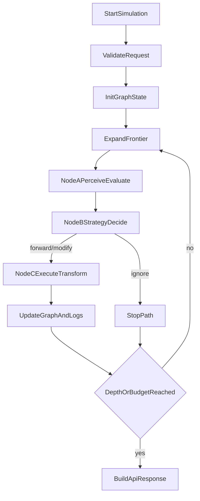

# 后端工程技术方案（V1）

> 文档定位：本文件用于指导后续后端开发落地，偏工程实现与交付约束。  
> 关系说明：`docs/后端方案.md` 偏研究与顶层叙事；本文件偏技术实现与执行细节。  
> 使用原则：后端开发默认以本文件为基线；若与 `docs/api/接口文档.md` 冲突，以接口文档为最高优先级。

---

## 1. 快速导航

- **先看边界**：`2. 目标与红线`
- **先看现状**：`2.4 当前状况（截至 Batch 11）`
- **再看怎么做**：`3. 架构与模块`、`4. 核心流程`
- **重点两块**：`5. 创新点工程化实现`、`6. Taxonomy 接入现状与过渡机制`
- **开工检查**：`10. 开发 TODO`、`11. 联调验收清单`
- **交接执行**：`13A. Node3 交接与 AI 续开发`

---

## 2. 目标与红线

### 2.1 V1 目标

- 在不破坏 API 契约的前提下，交付可联调、可复现、可解释的后端版本。
- 落地“叙事落差驱动拓扑涌现”的创新点，同时保证工程稳定性。
- 对齐 `docs/研究问题.md` 交互目标（Externalize / Steer / Inspect）并补齐关键输入项。

### 2.2 非目标（V1 暂不做）

- 不做生产级大规模并发能力（分布式队列、多机调度）。
- 不做一次性全量图形引擎重构（Node3 采用分阶段交付）。
- 不要求单批次完成全部论文评估能力（先保证后端可跑通与可复盘）。

### 2.3 契约与语义红线（不可破坏）

- 固定接口：
  - `POST /api/upload-case`（`FormData.chart_spec` + `FormData.metadata`）
  - `POST /api/simulation/start`
  - `GET /api/health`
- 固定枚举：
  - `agentCategories`: `Amplifier | Analyst | Bridger | Adverser`
  - `offset`: `none | minor | sig | major`
- 语义约束：
  - 输出保持中性、可验证，避免价值判断或夸大结论。

### 2.4 当前状况（截至 Batch 11）

- 已完成：
  - 主链路可跑：`upload-case -> simulation/start -> tree/agentLog/summary/pathOffsetTrend`
  - LangGraph 决策链可跑：NodeA/NodeB/NodeC + 条件路由
  - Taxonomy v3 已接入 NodeA/NodeB（`USE_TAXONOMY=true` 可切换）
  - 可追溯性可用：`provenance_chain` + run 快照落盘
  - `simulation/start` 已支持 `maxDepth`、`agentProfiles(role/institution)` 入参并生效（`mode` 仅兼容保留）
- 尚未完成（当前主缺口）：
  - `Extender` 到 `Analyst` 的后端映射已落地，需继续与前端文档口径收敛
  - Node3 仍为占位执行，未完成“参数协议 + 执行器 + 校验回滚”
  - 前后端“研究交互能力”尚未达到完全一致

---

## 3. 架构与模块

### 3.1 推荐技术栈

- 框架：FastAPI（Python 3.11+）
- 编排：LangGraph + LangChain
- 模型接入：统一 `LLMClient` 抽象
- 执行工具：Pillow（基础图像处理），后续可接 matplotlib/pandas
- 存储：本地文件（`storage/uploads`、`storage/runs`）+ 进程内缓存
- 运行：Uvicorn + Pydantic v2 + JSON 结构化日志

### 3.2 模块划分（建议目录）

- `backend/app/api/`：上传、模拟、健康检查路由
- `backend/app/schemas/`：请求/响应契约模型
- `backend/app/services/`：上传服务、模拟流程服务
- `backend/app/graph/`：GraphState、NodeA/B/C、条件路由
- `backend/app/agents/`：persona、prompt、响应解析
- `backend/app/transform/`：operation 执行器
- `backend/app/analysis/`：偏移趋势与摘要
- `backend/app/infra/`：配置、日志、存储
- `backend/tests/`：契约、流程、容错测试

### 3.3 状态模型（GraphState 最小集）

- `runId`
- `rootImageRef`
- `activeFrontier`
- `nodes`
- `edges`
- `agentLogs`
- `provenanceChain`
- `ruleSource`（`taxonomy|fallback`）

---

## 4. 核心流程（同步模式）

执行步骤：

1. 校验请求参数（范围、枚举、可选字段）
2. 初始化根节点 `SRC`
3. 按 frontier 循环调用 NodeA -> NodeB -> NodeC
4. 根据 `action` 路由：继续或终止分支
5. 达到 `maxDepth` 或预算后收敛并组装响应

---

## 5. 创新点工程化实现（重点）

目标：不靠固定分叉概率，而由“认知评估 -> 策略决策 -> 执行反馈”自然形成拓扑。

### 5.1 实现策略：混合决策架构

- **NodeA 语义评估器（LLM）**
  - 输入：父节点图文 + persona + topic/description
  - 输出：`inner_monologue`、`gap_type`、`confidence`
  - 约束：不直接执行变体，不直接写最终 offset
- **NodeB 策略选择器（LLM + RuleGuard）**
  - LLM 先给：`action`、`operations`、`shift_magnitude`
  - `RuleGuard` 后处理：白名单过滤、互斥修正、枚举归一、低置信降级
- **NodeC 原子执行器（Deterministic Executor）**
  - 只执行经过 RuleGuard 的操作
  - 每一步变更都落 provenance，确保可复现与可追踪
- **Conditional Routing**
  - `forward|modify`：生成子节点并继续
  - `ignore`：路径终止

### 5.2 选型理由

- 纯 LLM：灵活但不稳定，难复现实验
- 纯规则：稳定但创新表达不足
- 混合架构：兼顾语义驱动创新与工程可控性

### 5.3 可验证性产物（必须落盘）

- `gap_evidence`
- `selected_operations`
- `rule_adjustments`
- `node_decision_trace`

---

## 6. Taxonomy 接入现状与过渡机制（重点）

### 6.1 目标

- 在不破坏现有 API 的前提下，将 taxonomy 规则稳态接入 NodeA/NodeB 决策。
- 保持 fallback 可回退能力，避免实验阶段因规则波动导致系统不可用。

### 6.2 技术方案：TaxonomyAdapter 抽象层

统一能力接口：

- `get_personas(categories)`
- `get_operation_whitelist(persona)`
- `get_shift_prior(persona, gap_type)`

### 6.3 双规则源与切换（当前已落地）

- `taxonomy_v3`：`taxonomy_rules_v3.yaml`（NodeA/NodeB 最小接入已完成）
- `fallback`：`fallback_rules.yaml`（保底回退）
- 配置开关：`USE_TAXONOMY=true` 使用 v3；`false` 使用 fallback
- 切换要求：仅改配置，不改 API 与主流程

### 6.4 当前边界（明确）

- v3 规则当前主要作用于 NodeA/NodeB（落差判断与策略选择）。
- Node3 暂不进行真实 spec 执行，仅保留占位输出与链路可用性。
- 研究问题中的平台/机构细粒度控制（institution）尚未进入后端决策输入。

### 6.5 可观测性与实验对照

- 每次 run 必须记录：
  - `rule_source: taxonomy|fallback`
  - `rule_version`
  - `guard_adjustments_count`

---

## 7. API 契约落地要求

### 7.1 `POST /api/upload-case`

- 入参：`multipart/form-data`，必填 `chart_spec`、`metadata`；可选 `data`、`image`
- 出参：`{ caseRef?, chartSpecRef?, metadataRef?, dataRef?, imageRef? }`
- 约束：`chart_spec` 与 `metadata` 必须是合法 JSON，后端存为结构化案例供模拟引用

### 7.2 `POST /api/simulation/start`

- 入参：`agentCount`、`agentCategories`、`agentProfiles?`、`maxDepth?`、`mode?`（兼容）、`description?`、`topic?`、`caseRef?`、`chartSpecRef?`、`metadataRef?`、`imageRef?`
- 返回：同步完整结构（`ok/tree/agentLog/summary/pathOffsetTrend/overallVariantDescription/variantImageUrl`）
- 兼容要求：
  - 运行时需提供 `caseRef`（或同时提供 `chartSpecRef + metadataRef`）
  - `imageRef` 标记为废弃兼容字段，不作为主输入来源
  - `tree.nodes[]` 可选返回 `chartSpecUrl/chartSpec`

### 7.3 `GET /api/health`

- 固定返回 `{ "ok": true }`

---

## 8. 数据映射与一致性规则

- `TreeNode` 必备字段：`id,label,nodeType,offset,imageUrl`
- `TreeEdge`：`id,source,target,offset?`
- `Offset` 映射：
  - 合法：`none|minor|sig|major`
  - 非法值：降级 `minor` 并记录警告
- 一致性校验：
  - `summary.highestOffset` 与 `pathOffsetTrend` 对齐
  - `nodeCount/edgeCount` 与 `tree` 实际数量一致

---

## 9. 稳定性、容错与默认参数

### 9.1 容错策略

- LLM 非法 JSON：纠错重试 1 次；仍失败降级 `ignore`
- 执行器失败：回退文本层变体并保留节点
- 单节点失败不得中断全局 run
- 统一错误结构，避免前端解析失败

### 9.2 默认参数（V1）

- `max_depth=3`
- `branch_budget<=agentCount`（上限 6）
- `llm_timeout_ms=12000`
- `llm_retry=1`
- `confidence_threshold=0.55`
- `deterministic_seed=hash(runId)`

---

## 10. 开发 TODO（持续维护）

### 10.1 P0（先做，保证“研究问题可跑通”）

- [x] 固化三接口 Pydantic 契约模型（含枚举约束）
- [x] 跑通同步 simulation 闭环（tree/agentLog/summary/pathOffsetTrend）
- [x] 实现 `TaxonomyAdapter + fallback_rules.yaml`
- [x] 落地 NodeA/NodeB/NodeC + 条件路由
- [x] 实现 RuleGuard（白名单/冲突修正/枚举归一）
- [x] 完成 taxonomy v3 在 NodeA/NodeB 的最小接入（Batch 9）
- [x] `simulation/start` 接入 `maxDepth` 入参并覆盖服务层深度控制（Batch 11）
- [x] `simulation/start` 接入 `agentProfiles(role/institution)` 并进入 persona 选择逻辑（Batch 11）
- [x] 补齐“传播模式 mode”入参并映射到策略偏置（Batch 11）
- [x] 统一 `Extender` 与 `Analyst` 的后端映射口径（Batch 11）
- [ ] 与前端最终口径同步（agentProfiles 与 mode 的展示/提交规则）

### 10.2 P1（稳定性与可解释性）

- [x] provenance 全量记录（gap、operation、rule_adjustments）
- [x] run 快照落盘（用于回放和复现实验）
- [x] 完成契约测试、路由终止测试、一致性测试
- [x] 完成 `imageUrl` 回退策略与失败注记
- [x] Node3 参数协议（operation -> Vega-Lite 字段与参数约束）
- [x] Node3 执行器（真实 spec patch）
- [x] Node3 校验与回滚（结构校验 + 降级策略）
- [x] NodeC 按父节点 Vega-Lite 重构画面；taxonomy ops 仅作归因（Batch 66）

### 10.3 P2（扩展能力）

- [ ] 增加异步任务模式（`taskId` 轮询或 WebSocket）
- [ ] 引入 Redis/对象存储替代本地文件
- [ ] 支持 taxonomy 正式规则源版本化与热更新

### 10.4 待补充输入（研究侧/产品侧）

- [ ] Persona 字典（`role/motivation/style`）
- [ ] 操作词表细则（参数约束、最大改写幅度）
- [ ] 四类 agent 到 persona 池映射矩阵
- [ ] 偏移映射规则（`gap_type + operation_intensity -> offset`）
- [ ] `pathOffsetTrend` 聚合口径
- [ ] case 数据标准化字段（`case_id/topic/base_spec/base_data/metadata`）

---

## 11. 联调验收清单

- [ ] 接口字段与枚举完全符合 `docs/api/接口文档.md`
- [ ] 前端能渲染传播树并正确展示节点 `imageUrl`
- [ ] 节点点击后可查看 `variantDescription` 与 `offset`
- [ ] `agentLog` 时间序可读
- [ ] 全链路日志可按 `runId` 回放关键决策
- [ ] 支持研究问题中的基础可操控参数（`maxDepth`、`agentProfiles`、`mode`）
- [ ] 支持 Tracing/Attribution 的最小后端数据闭环（链路+操作+角色来源可追溯）

---

## 12. 实施约定

- 开发过程优先遵循本文件；论文叙事参考 `docs/后端方案.md`。
- 若行为变化影响前端，必须同步更新：
  - `docs/api/接口文档.md`
  - 本工程方案
  - 相关示例响应

---

## 13. 开发进度记录（分批）

### 13A. Node3 交接与 AI 续开发

- 专项交接文档：`docs/backend/Node3交接与AI续开发指南.md`
- 使用场景：
  - 学姐/下一个 AI 接手 Node3 开发
  - 需要对齐 Taxonomy 口径后继续 M1/M2/M3 三阶段开发
  - 需要快速恢复上下文并按固定流程推进（读文档、改代码、跑测试、留痕）
- 命名口径：
  - 统一使用 `Extender`
  - 后端仍兼容历史输入 `extensioner`（仅兼容，不作为主命名）

### Batch 1（已完成）

- 范围：
  - 后端 FastAPI 骨架与三接口上线：`/api/health`、`/api/upload`、`/api/simulation/start`
  - 建立 API 契约模型（Pydantic）
  - 提供同步 simulation 占位闭环（可返回 `tree/agentLog/summary/pathOffsetTrend`）
  - 增加基础接口测试
- 代码落点：
  - `backend/app/main.py`
  - `backend/app/api/`
  - `backend/app/schemas/api_contract.py`
  - `backend/app/services/upload_service.py`
  - `backend/app/services/simulation_service.py`
  - `backend/tests/test_api.py`
- 测试结果：
  - 命令：`cd backend && conda activate frame && python -m pytest -q tests/test_api.py`
  - 结果：`3 passed`
- 说明：
  - 当前 simulation 逻辑为 V1 联调占位实现，尚未接入 TaxonomyAdapter、NodeA/B/C、RuleGuard。

### Batch 2（已完成）

- 范围：
  - 删除无用目录：`backend/src`（已确认无代码引用）
  - 接入 `TaxonomyAdapter` 与 `fallback_rules.yaml`
  - 增加 `NodeA/NodeB/NodeC` 占位工作流与 `RuleGuard`
  - 将上述链路接入 `/api/simulation/start` 同步流程
  - 新增第二批组件测试
- 代码落点：
  - `backend/app/config/fallback_rules.yaml`
  - `backend/app/agents/taxonomy_adapter.py`
  - `backend/app/agents/rule_guard.py`
  - `backend/app/graph/workflow.py`
  - `backend/app/services/simulation_service.py`
  - `backend/tests/test_batch2_components.py`
- 说明：
  - 当前 NodeA/B/C 为 deterministic 占位实现（非真实 LLM 调用），用于先验证工程路径与契约稳定性。

### Batch 3（已完成）

- 范围：
  - 增加可插拔 `LLMClient`（默认关闭，走 deterministic fallback）
  - 抽离偏移分析模块 `OffsetAnalyzer`
  - 增加 run 快照持久化（`storage/runs/<run_id>.json`）
  - 在 simulation 流程中写入 `provenance_chain`
  - 新增 Batch3 测试（分析逻辑 + 快照落盘）
- 代码落点：
  - `backend/app/agents/llm_client.py`
  - `backend/app/analysis/offset_analyzer.py`
  - `backend/app/infra/storage.py`
  - `backend/app/services/simulation_service.py`
  - `backend/tests/test_batch3_persistence_and_analysis.py`
- 说明：
  - 目前已具备 LLM 接口抽象，但尚未接入 LangChain/LangGraph 的真实多智能体图编排，下一批进入该部分。

### Batch 4（已完成）

- 范围：
  - 接入 LangGraph `StateGraph`，实现 NodeA/NodeB/NodeC 条件路由
  - 将 simulation 主流程切换为通过 graph runner 执行单 agent 决策链
  - 补充 LangGraph 路由测试（continue/stop 两条分支）
  - 引入 `langgraph`、`langchain-core` 依赖
- 代码落点：
  - `backend/app/graph/langgraph_runner.py`
  - `backend/app/graph/workflow.py`
  - `backend/app/services/simulation_service.py`
  - `backend/app/tests/test_batch4_langgraph.py`
  - `backend/requirements.txt`
- 测试结果：
  - 命令：`cd backend && conda activate frame && python -m pytest -q`
  - 结果：`10 passed`
- 说明：
  - 当前已是 LangGraph 编排版本；后续可在保持接口不变前提下升级为多层拓扑和真实 LLM 调用。

### Batch 5（已完成）

- 范围：
  - 将 simulation 从单层扩展为多层 frontier 拓扑生成（受 `agentCount` 与 `SIM_MAX_DEPTH` 约束）
  - 明确 `imageUrl` 来源：以接口 `imageRef` 为准，不再依赖后端本地 case 回退
  - 数据资产位置调整：case 数据迁移到仓库根目录 `data/`，作为前后端共享研究资产
  - 优化偏移分析：基于 edge 关系计算 `highestOffsetPath`，并按最高路径生成 `pathOffsetTrend`
- 代码落点：
  - `backend/app/services/simulation_service.py`
  - `backend/app/analysis/offset_analyzer.py`
  - `backend/tests/test_batch5_topology_and_case_data.py`
- 测试结果：
  - 命令：`cd backend && conda activate frame && python -m pytest -q`
  - 结果：`14 passed`（含后续批次调整后的全量回归）
- 说明：
  - 后端运行主链路不直接读取本地 case 数据，保持与“前端上传/传参驱动”的使用方式一致。

### Batch 6（已完成）

- 范围：
  - 增加真实 LLM 调用开关（`USE_LLM=true` 时尝试远端调用，失败自动降级）
  - 增加全局统一错误结构（校验错误/HTTP 错误/未知错误）
  - 增加本地开发启动脚本 `scripts/dev.sh`
  - 补充第六批测试（错误结构与 LLM 开关降级）
- 代码落点：
  - `backend/app/agents/llm_client.py`
  - `backend/app/main.py`
  - `backend/scripts/dev.sh`
  - `backend/tests/test_batch6_error_and_llm_toggle.py`
  - `backend/README.md`
- 测试结果：
  - 命令：`cd backend && conda activate frame && python -m pytest -q`
  - 结果：`14 passed`
- 说明：
  - 默认配置依然走本地 fallback，保证可离线开发；切换到真实 LLM 时无需改主流程。

### Batch 7（已完成）

- 范围：
  - 以 `docs/api/接口文档.md` 为准完成契约对齐：新增 `POST /api/upload-case`
  - `simulation/start` 入参切换到 `caseRef` 主路径，并兼容 `chartSpecRef + metadataRef`
  - `simulation` 根节点支持从案例 metadata 自动补全标题/描述，支持 `chartSpecUrl/chartSpec`
  - 补充契约回归测试与错误路径测试
- 代码落点：
  - `backend/app/api/routes_upload.py`
  - `backend/app/api/routes_simulation.py`
  - `backend/app/services/upload_service.py`
  - `backend/app/services/simulation_service.py`
  - `backend/app/schemas/api_contract.py`
  - `backend/app/main.py`
  - `backend/tests/test_api.py`
  - `backend/tests/test_batch6_error_and_llm_toggle.py`
- 测试结果：
  - 命令：`conda activate frame && cd backend && python -m pytest -q`
  - 结果：`16 passed`
- 说明：
  - 保留 `POST /api/upload` 仅用于旧流程兼容，不再作为模拟主输入接口。

### Batch 8（已完成）

- 范围：
  - 收口环境变量管理：新增 `backend/.env` 与 `backend/.env.example`
  - 启动脚本支持自动读取 `.env`（`uvicorn --env-file .env`）
  - 新增集中配置模块 `app/config/settings.py`，统一管理 LLM 与 simulation 配置项
  - `LLMClient` 与 `SimulationService` 从分散 `os.getenv` 切换为统一 settings 读取
- 代码落点：
  - `backend/app/config/settings.py`
  - `backend/app/agents/llm_client.py`
  - `backend/app/services/simulation_service.py`
  - `backend/scripts/dev.sh`
  - `backend/.env.example`
  - `backend/.env`（本地配置文件）
  - `.gitignore`
  - `backend/README.md`
- 测试结果：
  - 命令：`conda run -n frame python -m pytest -q`
  - 结果：`16 passed`
- 说明：
  - 后续新增环境变量统一在 `settings.py` 增加并在 `README` 登记，避免配置膨胀失控。

### Batch 9（已完成）

- 范围：
  - 在保持 API 契约不变前提下，完成“Node3 之前”的 taxonomy v3 最小接入
  - `TaxonomyAdapter` 支持 `USE_TAXONOMY=true` 加载 v3 规则源（保留 fallback）
  - NodeA 输出补齐 v3 关键中间字段（alignment/gaps/intensity/reasoning）
  - NodeB 输出补齐结构化 `selected_operations` 与 `operation_rationale`，并继续经过 `RuleGuard`
  - Node3 保持占位执行，不进入 spec 真正改写（为后续独立交接预留）
- 代码落点：
  - `backend/app/config/taxonomy_rules_v3.yaml`
  - `backend/app/agents/taxonomy_adapter.py`
  - `backend/app/agents/llm_client.py`
  - `backend/app/graph/workflow.py`
  - `backend/app/services/simulation_service.py`
  - `backend/app/config/fallback_rules.yaml`
  - `backend/tests/test_batch2_components.py`
  - `backend/tests/test_batch4_langgraph.py`
- 测试结果：
  - 命令：`conda run -n frame python -m pytest -q`
  - 结果：`17 passed`
- 说明：
  - 本批刻意不改 Node3 执行器，仅完成 Node1/Node2 与 taxonomy v3 的可交付闭环，便于后续分工。

### Batch 11（已完成）

- 范围：
  - `simulation/start` 接入并生效 `maxDepth`、`agentProfiles`、`mode`
  - 将 `agentProfiles.role` 纳入类别决策（支持 `Extender -> Analyst` 映射，兼容历史拼写）
  - 将 `institution` 注入节点输出与上下文，支持后续归因分析展示
  - 根据 mode 对 shift prior 做偏置（`adversarial` 上调、`conservative` 下调）
- 代码落点：
  - `backend/app/schemas/api_contract.py`
  - `backend/app/services/simulation_service.py`
  - `backend/tests/test_api.py`
  - `backend/tests/test_batch5_topology_and_case_data.py`
- 测试结果：
  - 命令：`conda run -n frame python -m pytest -q`
  - 结果：`17 passed`
- 说明：
  - 本批仍保持 Node3 占位执行，优先完成研究问题中的“可操控输入生效”。

### Batch 13（已完成）

- 范围：
  - 落地 Node3 M1 的首批工程化产物：全量操作 schema（文档 + 机器可读 YAML）
  - `RuleGuard` 接入 `node3_operation_schema_v1.yaml`，新增 `selected_operations` 结构化校验入口
  - `NodeB` 改为直接使用 Guard 过滤后的 operation plan（层级归一、互斥过滤、数量上限）
  - 补充专项测试覆盖（层级归一 + 互斥过滤）
- 代码落点：
  - `backend/app/config/node3_operation_schema_v1.yaml`（新增）
  - `docs/taxonomy/node3_operation_schema_v1.md`（新增）
  - `backend/app/agents/rule_guard.py`
  - `backend/app/graph/workflow.py`
  - `backend/tests/test_batch2_components.py`
- 测试结果：
  - 命令：`conda run -n frame python -m pytest -q`
  - 结果：`18 passed`
- 说明：
  - 本批仍未进入 Node3 真实 spec patch（M2），当前为 M1 “参数协议 + Guard 接口化”基线
  - `delete_source` 仅作为规则定义落在 schema，执行与回滚将随 Node3 执行器（M2/M3）接入

### Batch 14（已完成）

- 范围：
  - Node3 M2 起步：新增 `node3_executor`，实现首批真实 Vega-Lite patch 能力
  - NodeC 从占位执行切换为调用执行器，产出 `updated_chart_spec` 与 `executed_operations`
  - simulation 主流程接入父子节点 spec 传递（`chartSpec` 上下文）与节点级 spec 输出
  - 新增 Node3 执行专项测试
- 代码落点：
  - `backend/app/transform/__init__.py`（新增）
  - `backend/app/transform/node3_executor.py`（新增）
  - `backend/app/graph/workflow.py`
  - `backend/app/graph/langgraph_runner.py`
  - `backend/app/services/simulation_service.py`
  - `backend/tests/test_batch13_node3_executor.py`（新增）
- 测试结果：
  - 命令：`conda run -n frame python -m pytest -q`
  - 结果：`20 passed`
- 说明：
  - 已支持真实改写的首批操作：`change_title`、`add_annotation`、`delete_source`、`change_color`、`select_data_range`、`add_data_variables`
  - `add_annotation` 执行策略为“图内优先（layer text mark）+ metadata fallback”
  - `delete_source` 执行严格匹配前缀：`source:`、`sources:`、`data source`、`via`、`from`

### Batch 15（已完成）

- 范围：
  - Node3 M3 起步：新增 `spec_validator`，接入 NodeC 分级回滚
  - 实现执行失败分层策略：`fallback_text` 与 `node_rollback`
  - simulation provenance 增补执行模式与校验错误字段
  - 新增 Node3 M3 专项测试（回滚与降级路径）
- 代码落点：
  - `backend/app/transform/spec_validator.py`（新增）
  - `backend/app/graph/workflow.py`
  - `backend/app/services/simulation_service.py`
  - `backend/tests/test_batch13_node3_executor.py`
- 测试结果：
  - 命令：`conda run -n frame python -m pytest -q`
  - 结果：`23 passed`
- 说明：
  - 当前已具备 `skip_op`（单 op 无法执行即跳过）+ `fallback_text`（全部失败）+ `node_rollback`（spec 校验失败）三层容错骨架
  - `spec_validator` 当前为结构合法性 MVP，后续可扩展语义一致性校验规则

### Batch 16（已完成）

- 范围：
  - 打通“Node3 变体 spec -> 节点图片”显示链路，避免子节点沿用根图造成“看起来没变化”
  - 新增 `spec_renderer`，将节点 `chartSpec` 渲染为 `imageUrl`（优先 Vega-Lite SVG，失败回退摘要 SVG）
  - simulation 节点 imageUrl 改为优先使用渲染结果
- 代码落点：
  - `backend/app/transform/spec_renderer.py`（新增）
  - `backend/app/services/simulation_service.py`
  - `backend/tests/test_batch13_node3_executor.py`
  - `backend/tests/test_api.py`
- 测试结果：
  - 命令：`conda run -n frame python -m pytest -q`
  - 结果：`24 passed`
- 说明：
  - root 节点仍优先显示上传原图（若存在）
  - 非 root 节点在有 `updated_chart_spec` 时优先使用渲染 data URL，提升前端可观察性

### Batch 17（已完成）

- 范围：
  - 修复前端联调中“节点操作层级不显示、节点数少于配置数”的对齐问题
  - simulation 节点现在为每个 agent 都生成节点（`ignore` 节点不再被直接跳过）
  - 节点 `operations` 输出改为前端可识别格式：`DATA/TEXT/VISUAL + 操作描述`
  - 增加真实 Vega-Lite 渲染依赖，避免长期停留在摘要 SVG 降级图
- 代码落点：
  - `backend/app/services/simulation_service.py`
  - `backend/tests/test_api.py`
  - `backend/requirements.txt`
- 测试结果：
  - 命令：`conda run -n frame python -m pytest -q`
  - 结果：`24 passed`
- 说明：
  - 该批重点是“显示与可解释性对齐”，不改变 API 路径与主字段契约
  - `ignore` 路径不再推进 frontier，但会保留节点与边，便于追踪完整 agent 决策链

### Batch 18（已完成）

- 范围：
  - 修复前端联调中 `Extender` 角色可见性问题（后端内部 `Analyst` 分类对外显示为 `Extender`）
  - 优化 `add_annotation` 的图内放置策略，避免多次标注重叠在同一坐标
  - 新增专项测试覆盖角色展示与注释错位行为
- 代码落点：
  - `backend/app/services/simulation_service.py`
  - `backend/app/transform/node3_executor.py`
  - `backend/tests/test_batch13_node3_executor.py`
  - `backend/tests/test_api.py`
- 测试结果：
  - 命令：`conda run -n frame python -m pytest -q`
  - 结果：`25 passed`
- 说明：
  - 不改动 API 路径与字段名，仅调整节点 `role` 展示文案与图内注释布局策略
  - `add_annotation` 新策略会基于现有 text layer 的位置自动计算下一条注释坐标（纵向递增 + 横向交替）

### Batch 19（已完成）

- 范围：
  - 升级 `add_annotation` 为数据锚点注释：优先落在需强调的数据点，而非固定画布坐标
  - 注释视觉增强：新增锚点高亮（point）+ 引导线（leader line）+ 注释文本（text）
  - 继续保留无可靠数据锚点时的回退策略（原有避障文本注释）
- 代码落点：
  - `backend/app/transform/node3_executor.py`
  - `backend/tests/test_batch13_node3_executor.py`
- 测试结果：
  - 命令：`conda run -n frame python -m pytest -q`
  - 结果：`26 passed`
- 说明：
  - 锚点选择基于 `intent` 关键词（如 peak/max/min/latest）与数据启发式
  - 多次注释时会在数据空间做上下偏移，减少标签相互遮挡

### Batch 20（已完成）

- 范围：
  - 修复 simulation 拓扑扩展为“按层分配 agent”（agent pool），避免链式扩散导致 `agentCount` 用不满
  - 当一层全部为 `ignore` 时，启用 pass-through frontier，避免传播链过早中断
  - 节点角色展示优先使用请求中的 profile 角色，确保 `Extender` 在前端可见
- 代码落点：
  - `backend/app/services/simulation_service.py`
  - `backend/tests/test_batch5_topology_and_case_data.py`
- 测试结果：
  - 命令：`conda run -n frame python -m pytest -q`
  - 结果：`27 passed`
- 说明：
  - 该批不改动 API 字段，仅调整节点生成策略与角色展示优先级
  - 在 `maxDepth` 约束内，系统会尽量消费完 `agentCount`

### Batch 21（已完成）

- 范围：
  - 落地“前端 profile 硬约束 + F2 转移选择”的 agent 池调度
  - 在每层扩展中按父节点角色与 F2 转移权重，从“未使用 profile 池”选择响应 agent
  - 保证 profile 一次性消费，不发生二次复用
- 代码落点：
  - `backend/app/config/taxonomy_rules_v3.yaml`
  - `backend/app/agents/taxonomy_adapter.py`
  - `backend/app/services/simulation_service.py`
  - `backend/tests/test_batch5_topology_and_case_data.py`
- 测试结果：
  - 命令：`conda run -n frame python -m pytest -q`
  - 结果：`27 passed`
- 说明：
  - `agentProfiles` 存在时，`branch_budget` 由 `min(agentCount, len(agentProfiles))` 决定
  - `SRC` 默认按 Bridger 作为 F2 起点，优先触发 `Bridger -> Amplifier` 等转移倾向

### Batch 22（已完成）

- 范围：
  - 完成 Node3 B 项：执行器扩展 4 个 codebook op（`simplify_axis`、`change_axis_scale`、`change_legend`、`add_legend`）
  - 完成 Node3 A 项：`spec_validator` 从结构校验升级到语义校验（encoding/axis/legend 协调约束）
  - 补充专项测试覆盖新执行能力与语义回滚触发条件
- 代码落点：
  - `backend/app/transform/node3_executor.py`
  - `backend/app/transform/spec_validator.py`
  - `backend/tests/test_batch13_node3_executor.py`
- 测试结果：
  - 命令：`conda run -n frame python -m pytest -q`
  - 结果：`29 passed`
- 说明：
  - `change_legend` 目标选择策略：优先已有 legend 的通道，其次非位置通道，避免误改 x/y
  - 语义校验新增典型规则：`x2/y2` 需对应 `x/y`、非位置通道禁止 axis、位置通道禁止 legend、encoding 通道需具备 `field/value/datum`

### Batch 23（已完成）

- 范围：
  - 根据 taxonomy 语义约束收紧 `add_legend` 与 `simplify_axis` 执行条件
  - 提升 NodeB 策略选择的“角色签名感”：引入 persona/context/whitelist 感知，避免长期偏向纯 text 操作
  - 增强 `change_color` 可见性（多目标覆盖 + 意图驱动配色）
- 代码落点：
  - `backend/app/graph/workflow.py`
  - `backend/app/graph/langgraph_runner.py`
  - `backend/app/agents/llm_client.py`
  - `backend/app/transform/node3_executor.py`
  - `backend/app/config/node3_operation_schema_v1.yaml`
  - `docs/taxonomy/node3_operation_schema_v1.md`
  - `backend/tests/test_batch13_node3_executor.py`
- 测试结果：
  - 命令：`conda run -n frame python -m pytest -q`
  - 结果：`30 passed`
- 说明：
  - `add_legend` 仅在“当前无 legend + 意图包含强调语义”时生效
  - `simplify_axis` 当前只对 x 轴简化，降低语义损伤风险
  - fallback 策略按角色签名优先分配 data/visual/text 组合，减少“只改文本”的单一倾向

### Batch 24（已完成）

- 范围：
  - 完成 Node3 剩余 6 个 op 的执行覆盖：`select_data_variables`、`change_data_granularity`、`change_chart_type`、`add_background`、`change_aspect_ratio`、`change_annotation`
  - provenance 升级为细粒度 operation 审计（`params/target_paths/status/error`）
  - 前端右侧 Process 补充机构展示（institution）
  - API 口径同步：`mode/platform` 标记为兼容遗留，不再作为主控概念
- 代码落点：
  - `backend/app/transform/node3_executor.py`
  - `backend/app/graph/workflow.py`
  - `backend/app/services/simulation_service.py`
  - `backend/app/config/taxonomy_rules_v3.yaml`
  - `backend/app/config/fallback_rules.yaml`
  - `backend/app/schemas/api_contract.py`
  - `backend/tests/test_batch13_node3_executor.py`
  - `frontend/src/features/offset/OffsetPanel.tsx`
  - `docs/api/接口文档.md`
- 测试结果：
  - 后端：`conda run -n frame python -m pytest -q` -> `31 passed`
  - 前端：`npm run build` -> build 成功（含 Node 版本升级提示，不阻塞本次构建）
- 说明：
  - `operation_audit` 记录每个 op 的执行/跳过细节，`executed_operations` 仅保留已应用操作
  - NodeB 策略仍兼容 LLM/fallback 双路径，但优先遵循 taxonomy 角色签名与 whitelist

### Batch 25（已完成）

- 范围：
  - 将节点级 `operation_audit` 暴露到 API `tree.nodes[]`，支持前端 process 解释“执行/跳过”原因
  - 调整右侧 Preview 高度，改善节点大图展示完整性
  - 修正中间传播图与右侧 process 的 `analyst` 图标配色映射，避免出现不在四类角色定义内的“黄色误导色”
- 代码落点：
  - `backend/app/schemas/api_contract.py`
  - `backend/app/services/simulation_service.py`
  - `frontend/src/types/contracts.ts`
  - `frontend/src/features/offset/OffsetPanel.tsx`
  - `frontend/src/features/propagation/PropagationPanel.tsx`
  - `docs/api/接口文档.md`
- 测试结果：
  - 后端：`conda run -n frame python -m pytest -q` -> `31 passed`
  - 前端：`npm run build` -> build 成功（Node 版本建议升级提示不阻塞）
- 说明：
  - 右侧 Process 当前展示 `operation_audit` 前 4 条摘要，可用于快速理解策略执行结果
  - `analyst` 颜色统一映射到 Extender 颜色体系，保持四类 agent 视觉一致性

### Batch 26（已完成）

- 范围：
  - 按用户反馈撤回前端 Process 中的 `operation_audit` 展示
  - 取消 `tree.nodes[]` 对 `operationAudit` 字段的接口暴露，回归简洁节点结构
- 代码落点：
  - `backend/app/schemas/api_contract.py`
  - `backend/app/services/simulation_service.py`
  - `frontend/src/types/contracts.ts`
  - `frontend/src/features/offset/OffsetPanel.tsx`
  - `docs/api/接口文档.md`
- 测试结果：
  - 后端：`conda run -n frame python -m pytest -q` -> `31 passed`
  - 前端：`npm run build` -> build 成功
- 说明：
  - 后端内部仍保留 `provenance_chain.operation_audit`，可用于调试与复盘

### Batch 27（已完成）

- 范围：
  - 提升 NodeB fallback 策略的语义感知能力：从“角色模板”升级到“Who(角色) + Where(机构/平台语境) + Topic(内容信号)”联合决策
  - 增强 Node3 `change_title` 与 `change_color` 的 intent 可执行性，支持更贴近语料叙事的精确标题和主题配色
  - 补充 Node3 operation schema（文档 + YAML）的策略层说明，沉淀 who/where/how 指导规则
- 代码落点：
  - `backend/app/agents/llm_client.py`
  - `backend/app/transform/node3_executor.py`
  - `backend/app/config/node3_operation_schema_v1.yaml`
  - `docs/taxonomy/node3_operation_schema_v1.md`
- 测试结果：
  - 命令：`conda run -n frame python -m pytest -q`
  - 结果：`31 passed`
- 说明：
  - 该批不改 API 路径与主字段，仅增强策略与执行行为
  - NodeC 继续保持 deterministic 执行（可复现），语义智能主要前置在 NodeB 计划阶段

### Batch 28（已完成）

- 范围：
  - NodeB LLM prompt 升级为 who/where/how 导向，加入 taxonomy v3 角色签名、平台语境与内容语义锚点
  - NodeC 增加“LLM 执行意图细化”入口：在执行前细化标题/配色/注释意图，再交由 deterministic executor 落地
  - 修复缺少 persona 上下文时的 shift 退化问题，保障冲突路径不被错误降级
- 代码落点：
  - `backend/app/agents/llm_client.py`
  - `backend/app/graph/workflow.py`
  - `backend/app/services/simulation_service.py`
- 测试结果：
  - 命令：`/opt/anaconda3/envs/frame/bin/python -m pytest -q tests/test_batch2_components.py tests/test_batch13_node3_executor.py`
  - 结果：`17 passed`
- 说明：
  - 本批核心是把“LLM 参与决策/生成”从 NodeB 延伸到 NodeC 预执行阶段
  - Node3 仍由确定性 patch 执行，保证可解释与可回滚

### Batch 29（已完成）

- 范围：
  - NodeB/NodeC prompt 进一步收紧：要求 `add_annotation` 输出数据支撑文本，禁止泛化口号
  - Node3 `add_annotation` 支持 `trendline: true` 指令，并真实向 Vega-Lite 注入趋势线 layer
  - fallback 路径新增数据摘要注释生成（起止值、峰值），提升无 LLM 或 LLM 失败时的“言之有物”程度
- 代码落点：
  - `backend/app/agents/llm_client.py`
  - `backend/app/transform/node3_executor.py`
  - `backend/app/config/node3_operation_schema_v1.yaml`
  - `docs/taxonomy/node3_operation_schema_v1.md`
  - `backend/tests/test_batch13_node3_executor.py`
- 测试结果：
  - 命令：`/opt/anaconda3/envs/frame/bin/python -m pytest -q tests/test_batch2_components.py tests/test_batch13_node3_executor.py`
  - 结果：`18 passed`
- 说明：
  - 本批实现“标题语义 -> 注释语义 -> 图内趋势线”联动执行
  - 仍保持 Node3 deterministic 可回放与校验回滚机制

### Batch 30（已完成）

- 范围：
  - NodeB `selected_operations` 升级为结构化执行协议：`{operation, layer, intent, params}`
  - Node3 Executor 按 `params` 落地执行，重点增强全图配色覆盖、标题/注释自动换行、注释趋势线布尔开关
  - Extender(Analyst)策略调整：弱化 `add_data_variables` 默认使用，优先变量筛选与上下文扩展
- 代码落点：
  - `backend/app/agents/llm_client.py`
  - `backend/app/agents/rule_guard.py`
  - `backend/app/graph/workflow.py`
  - `backend/app/transform/node3_executor.py`
  - `backend/app/config/node3_operation_schema_v1.yaml`
  - `docs/taxonomy/node3_operation_schema_v1.md`
  - `backend/tests/test_batch2_components.py`
  - `backend/tests/test_batch13_node3_executor.py`
- 测试结果：
  - 命令：`conda run -n frame python -m pytest -q tests/test_batch2_components.py tests/test_batch13_node3_executor.py`
  - 结果：`20 passed`
- 说明：
  - 通过结构化 `params` 将“语义文本”与“执行指令”解耦，减少机械化 intent 文本
  - 在保留 deterministic executor 的前提下，提升 NodeC 对 LLM 计划的可执行一致性

### Batch 31（已完成）

- 范围：
  - `select_data_range` 完成参数化执行：支持 `params.x_field/start/end` 的真实窗口过滤
  - NodeB fallback 增加区间参数生成（基于输入图表 x 序列），避免仅输出泛化“缩小范围”意图
  - NodeB LLM prompt 增补 `select_data_range` 参数示例，提升 LLM 输出结构化计划的一致性
- 代码落点：
  - `backend/app/agents/llm_client.py`
  - `backend/app/transform/node3_executor.py`
  - `backend/app/config/node3_operation_schema_v1.yaml`
  - `docs/taxonomy/node3_operation_schema_v1.md`
  - `backend/tests/test_batch13_node3_executor.py`
- 测试结果：
  - 命令：`conda run -n frame python -m pytest -q tests/test_batch2_components.py tests/test_batch13_node3_executor.py`
  - 结果：`21 passed`
- 说明：
  - 本批进一步强化 “LLM 计划 -> deterministic 执行” 的参数桥接，保持可解释与可回放

### Batch 32（已完成）

- 范围：
  - 角色意图增强：社媒 Amplifier 的 `change_color` 默认携带高对比平台美学参数（`palette_style=social_contrast`）
  - 注释可读性增强：`add_annotation`/`change_annotation` 新增最小字号、宽度限制与无空格文本换行能力
  - 叙事一致性增强：支持按 `narrative_keywords` 清理离题 annotation，降低“旧注释残留”干扰
  - 标题-注释联动增强：Amplifier/Analyst/Adverser 的注释内容默认解释其标题 framing 意图
- 代码落点：
  - `backend/app/agents/llm_client.py`
  - `backend/app/transform/node3_executor.py`
  - `backend/app/config/node3_operation_schema_v1.yaml`
  - `docs/taxonomy/node3_operation_schema_v1.md`
  - `backend/tests/test_batch13_node3_executor.py`
- 测试结果：
  - 命令：`conda run -n frame python -m pytest -q tests/test_batch13_node3_executor.py tests/test_batch2_components.py`
  - 结果：`23 passed`
- 说明：
  - 本批聚焦“可一眼辨别框架偏移”，在不破坏 API 契约下提升视觉可读性与叙事对齐

### Batch 33（已完成）

- 范围：
  - 修复 `change_color` 生效目标：仅作用于图表数据 marks 与调色盘，不再误改文本 mark 颜色
  - 强化 Amplifier 新闻媒体约束：`t2_media` 下确保 `change_color` 被纳入执行计划
  - 强化 `select_data_range` 生效方式：从弱约束过滤升级为 `datum` 表达式区间过滤（跨数值/字符串字段更稳）
- 代码落点：
  - `backend/app/agents/llm_client.py`
  - `backend/app/transform/node3_executor.py`
  - `backend/app/config/node3_operation_schema_v1.yaml`
  - `docs/taxonomy/node3_operation_schema_v1.md`
  - `backend/tests/test_batch13_node3_executor.py`
- 测试结果：
  - 命令：`conda run -n frame python -m pytest -q tests/test_batch13_node3_executor.py tests/test_batch2_components.py`
  - 结果：`24 passed`
- 说明：
  - 本批以“用户可见生效”为目标，优先修复执行层问题（不仅是 prompt 文案）

### Batch 34（已完成）

- 范围：
  - 按最新 `taxonomy_codebook` 细化 5 类操作实现：`change_color`、`change_title`、`add_annotation`、`change_annotation`、`simplify_axis`
  - `change_title` 强化数据锚点生成（基于峰值/趋势形成角色化标题）
  - `simplify_axis` 新增“稀疏保留刻度”模式（interval_labels），贴合新闻媒体常见简化风格
  - Analyst 增补 `change_annotation` 路径，支持“删旧注释 + 新叙事注释”联动
- 代码落点：
  - `backend/app/agents/llm_client.py`
  - `backend/app/transform/node3_executor.py`
  - `backend/app/config/node3_operation_schema_v1.yaml`
  - `docs/taxonomy/node3_operation_schema_v1.md`
  - `backend/tests/test_batch2_components.py`
  - `backend/tests/test_batch13_node3_executor.py`
- 测试结果：
  - 命令：`conda run -n frame python -m pytest -q tests/test_batch2_components.py tests/test_batch13_node3_executor.py`
  - 结果：`26 passed`
- 说明：
  - 本批确保“codebook 语义 -> prompt 策略 -> executor 参数”三层一致，避免只在 prompt 层优化

### Batch 35（已完成）

- 范围：
  - annotation 视觉与文案专项修复：去除可能导致“没说完”的文本截断策略，统一完整句输出
  - Amplifier 注释路径升级：若已存在注释则优先 `change_annotation`（强调样式），否则 `add_annotation`
  - `change_annotation` 新增强调样式参数（`emphasis_style=amplify`），用于加粗/增大/大写（英文）突出
  - annotation 默认换行阈值收紧到 `34`，提升版面稳定性
- 代码落点：
  - `backend/app/agents/llm_client.py`
  - `backend/app/transform/node3_executor.py`
  - `backend/app/config/node3_operation_schema_v1.yaml`
  - `docs/taxonomy/node3_operation_schema_v1.md`
  - `backend/tests/test_batch2_components.py`
  - `backend/tests/test_batch13_node3_executor.py`
- 测试结果：
  - 命令：`conda run -n frame python -m pytest -q tests/test_batch2_components.py tests/test_batch13_node3_executor.py`
  - 结果：`28 passed`
- 说明：
  - 本批针对“annotation 不美观/不完整”反馈做专项收敛，优先保证可读性与叙事完整句

### Batch 37（已完成）

- 范围：
  - 修复 annotation 越界：新增注释坐标边界钳制，避免注释文本跑出图表画布
  - 优化锚点注释布局：锚点靠右时自动切换右对齐并使用负向 `dx`，降低右边缘溢出
  - `change_annotation` 改写时对已有像素坐标注释执行位置归一，避免历史越界持续保留
- 代码落点：
  - `backend/app/transform/node3_executor.py`
  - `backend/tests/test_batch13_node3_executor.py`
- 测试结果：
  - 命令：`conda run -n frame python -m pytest -q tests/test_batch13_node3_executor.py tests/test_batch2_components.py`
  - 结果：`30 passed`
- 说明：
  - 本批只改 Node3 注释布局与可读性安全边界，不涉及 API 契约变化

### Batch 38（已完成）

- 范围：
  - 继续收敛 annotation 越界与过长问题：根据画布宽度与锚点左右位置动态估算可用文本宽度并自动换行
  - `add_annotation` / `change_annotation` 默认换行阈值从 34 收紧到 32（执行层与策略层同步）
  - 精简 Analyst/Adverser 注释文案模板，减少多从句导致的长注释
- 代码落点：
  - `backend/app/transform/node3_executor.py`
  - `backend/app/agents/llm_client.py`
  - `backend/tests/test_batch13_node3_executor.py`
- 测试结果：
  - 命令：`conda run -n frame python -m pytest -q tests/test_batch13_node3_executor.py tests/test_batch2_components.py`
  - 结果：`30 passed`
- 说明：
  - 本批重点是“annotation 简洁+完整+可显示”，避免左右两侧越界并保持标题呼应

### Batch 39（已完成）

- 范围：
  - `change_color` 收敛为“数据标记优先”：仅对 line/bar/area/point 等主数据 mark 生效，不再联动背景层
  - 角色意图配色强化：Amplifier/Adverser 在媒体与社交场景默认使用 `social_contrast`，并通过 intent 区分“强化叙事”与“对立叙事”
  - 移除 Amplifier 在 deforestation 场景下的自动 `add_background` 绑定，避免把“改配色”误变成“改背景”
- 代码落点：
  - `backend/app/agents/llm_client.py`
  - `backend/app/transform/node3_executor.py`
  - `backend/app/config/node3_operation_schema_v1.yaml`
  - `docs/taxonomy/node3_operation_schema_v1.md`
  - `backend/tests/test_batch2_components.py`
  - `backend/tests/test_batch13_node3_executor.py`
- 测试结果：
  - 命令：`conda run -n frame python -m pytest -q tests/test_batch2_components.py tests/test_batch13_node3_executor.py`
  - 结果：`32 passed`
- 说明：
  - 本批按 `taxonomy_codebook`（change color / change title / add annotation / delete source / legend）继续收敛策略层与执行层一致性

### Batch 53（已完成）

- 范围：
  - 修复前端 DATA/VISUAL 虚线样式对调问题
  - 增强后端 agent 平台感知能力：同角色不同平台产出差异化修改（标题、颜色、注释、操作强度）
  - NodeC 将 `llm_client` 传递给 `Node3Executor`，使执行阶段可调用 LLM 生成文本
  - gap 评估、策略选择、操作强度估算均引入平台因子
- 代码落点：
  - `frontend/src/features/propagation/PropagationPanel.tsx`
  - `backend/app/graph/workflow.py`
  - `backend/app/agents/llm_client.py`
- 测试结果：
  - 后端：49 passed, 2 pre-existing failures
  - 前端：`npm run build` → 成功
- 说明：
  - 核心改进：Extender/Analyst/Adverser 的 `_build_title_intent` 现在按 `platform_bucket` 分化标题
  - 社交平台 → 更激进/直白，权威平台 → 更审慎/政策化，媒体平台 → 编辑视角
  - Amplifier 在 resonance 路径下不再仅执行 `change_color`，至少保留颜色+标题两个操作

### Batch 42（已完成）

- 范围：
  - 修复 add annotation 后可能出现的左右轴重叠（右侧额外 y 轴）
  - 修复 `select_data_range` 仅过滤数据但不收缩 x 轴显示范围的问题
- 代码落点：
  - `backend/app/transform/node3_executor.py`
  - `backend/tests/test_batch13_node3_executor.py`
  - `docs/backend/CHANGELOG.md`
- 测试结果：
  - 命令：`conda run -n frame python -m pytest -q tests/test_batch13_node3_executor.py tests/test_batch2_components.py`
  - 结果：`32 passed`
- 说明：
  - 注释层从 `field: y_label` 改为 `datum` 定位，避免 synthetic 字段触发独立 y-scale/y-axis
  - `select_data_range` 在追加 filter 同时写入 `encoding.x.scale.domain=[start,end]`，确保轴域与筛选窗口一致

### Batch 44（已完成）

- 范围：
  - 修复 `change_color` 在条件着色图表（`encoding.color.condition/value`）中“显示执行但主色不变”的问题
  - 修复注释 trendline 引入 `x2_value/y2_value` 字段导致的 y 轴标题与尺度混乱
  - 右侧 process 增加所属平台（institution）展示，满足“角色+平台+操作”可解释性
- 代码落点：
  - `backend/app/transform/node3_executor.py`
  - `backend/app/services/simulation_service.py`
  - `backend/tests/test_batch13_node3_executor.py`
  - `frontend/src/features/offset/OffsetPanel.tsx`
  - `docs/backend/CHANGELOG.md`
- 测试结果：
  - 命令：`conda run -n frame python -m pytest -q tests/test_batch13_node3_executor.py tests/test_batch2_components.py`
  - 结果：`33 passed`
- 说明：
  - 本批聚焦“执行可见性”和“过程可解释性”：既让改色真正落在 mark/condition 上，也让 process 呈现实际执行语义与平台上下文

### Batch 45（已完成）

- 范围：
  - 落实 taxonomy 约束：Bridger 默认不执行 `change_title`、`simplify_axis`
  - 修复注释趋势线误触发导致的“指向空白”观感问题
- 代码落点：
  - `backend/app/agents/llm_client.py`
  - `backend/app/transform/node3_executor.py`
  - `backend/tests/test_batch2_components.py`
  - `backend/tests/test_batch13_node3_executor.py`
  - `docs/backend/CHANGELOG.md`
- 测试结果：
  - 命令：`conda run -n frame python -m pytest -q tests/test_batch2_components.py tests/test_batch13_node3_executor.py`
  - 结果：`35 passed`
- 说明：
  - 通过“LLM 输出归一化 + refine 二次过滤 + fallback 分支”三重约束保证 Bridger 行为稳定
  - trendline 由“语义词自动触发”改为“显式指令触发”，减少误导性线条

### Batch 46（已完成）

- 范围：
  - Bridger 行为进一步收敛为“仅 change_color”
  - process 操作展示升级为“审计优先 + 状态可见”（applied/skipped）
- 代码落点：
  - `backend/app/agents/llm_client.py`
  - `backend/app/services/simulation_service.py`
  - `backend/tests/test_batch2_components.py`
  - `backend/tests/test_batch5_topology_and_case_data.py`
  - `docs/backend/CHANGELOG.md`
- 测试结果：
  - 命令：`python -m pytest -q tests/test_batch2_components.py tests/test_batch13_node3_executor.py`
  - 结果：`36 passed`
- 说明：
  - 本批将“Bridger 单操作约束”落到 fallback/LLM normalize/refine 三层，避免模型输出波动
  - process 不再只展示计划项，改为优先展示执行审计，解决“执行了但右侧没完整记录”的可解释性问题

### Batch 47（已完成）

- 范围：
  - 实现深度偏移递增机制（Depth-Progressive Offset Escalation）
  - 实现链路上下文追踪（Chain Context Tracking），每个智能体感知前序修改历史
  - 增强 LLM NodeA/NodeB prompt，赋予智能体自主感知与决策能力
  - 增强 Fallback 策略的深度感知与上下文感知
- 代码落点：
  - `backend/app/services/simulation_service.py`
  - `backend/app/agents/llm_client.py`
  - `docs/backend/CHANGELOG.md`
- 测试结果：
  - 命令：`conda run -n frame python -m pytest -q`
  - 结果：`50 passed, 1 pre-existing failure`
- 说明：
  - 深度偏移递增：depth=1 基线，depth=2 升一级，depth=3+ 升两级
  - 链路上下文：`node_chain_history` 记录角色、平台、操作、偏移，传递给下游智能体
  - LLM prompt 重设计为"自主决策"导向，包含完整 taxonomy 角色描述与平台行为差异
  - Fallback 路径同步增强：gap_type、intensity、operations 均随深度递增

### Batch 51（已完成）

- 范围：
  - 修复同角色不同平台时子节点颜色完全相同的问题
  - 实现随传播深度增加颜色逐步加深的视觉递进效果
  - 平台分桶从 3 桶细化为 6 桶（authority, news, social, ugc, blog, data）
- 代码落点：
  - `backend/app/transform/node3_executor.py` — 核心：平台桶、颜色映射、深度加深
  - `backend/app/graph/workflow.py` — 传递 depth 到 executor
  - `docs/backend/CHANGELOG.md`
- 测试结果：
  - 命令：`conda run -n frame python -m pytest tests/ -q --deselect ...trendline`
  - 结果：`50 passed, 1 deselected`
- 说明：
  - 同角色不同平台使用明显不同色相（如 Amplifier: News 橙红, Social 亮橙, UGC 品红, Blog 暗砖红）
  - 深度递进：depth=1 原色 → depth=2 加深15% → depth=3 加深30% → depth=4+ 加深40%
  - palette_range 和 secondary_color 均改为算法动态生成，适配任意颜色输入

### Batch 52（已完成）

- 范围：
  - 修复 Adverser 执行操作后图表数据消失的问题
  - 修复注释文字超出图表区域导致画布过长的问题
- 代码落点：
  - `backend/app/transform/node3_executor.py` — 核心：select_data_range 保护、change_axis_scale 安全域、注释 limit/行数限制、空数据回滚
  - `backend/tests/test_batch13_node3_executor.py` — 适配注释 limit 断言
- 测试结果：
  - 命令：`conda run -n frame python -m pytest tests/ -q --deselect ...trendline`
  - 结果：`50 passed, 1 deselected`
- 说明：
  - select_data_range 执行前预判存活行数 ≥ 2，否则跳过
  - change_axis_scale 域边界确保包含全部数据点
  - 执行后空数据检测 + 自动回滚
  - 注释最多 3 行，text mark 添加 limit 属性防溢出
  - Adverser decline/growth 窗口最小 5 点宽度

### Batch 61（已完成）

- 范围：
  - Bridger 在第三方数据平台（`t4_data`）上新增 `change_chart_type` 操作能力
  - 保持 Bridger 在 authority/news/social 平台仍仅限 `change_color`
  - 图表类型自动推荐：bar → line, point → line
- 代码落点：
  - `backend/app/config/taxonomy_rules_v3.yaml`
  - `backend/app/agents/llm_client.py`
  - `backend/tests/test_batch2_components.py`
- 测试结果：
  - 命令：`conda run -n frame python -m pytest -q tests/test_batch2_components.py tests/test_batch13_node3_executor.py`
  - 结果：`36 passed, 2 pre-existing failures`
- 说明：
  - 该批仅放宽 Bridger 在数据平台上的操作约束，不改 API 路径与字段
  - `_suggest_bridger_chart_type` 默认将 bar/point 转为 line，贴合数据平台展示趋势的常见做法

### Batch 64（已完成）

- 范围：
  - DeepSeek JSON 调用关闭 thinking、强制 IPv4、关闭 HTTP keepalive、超时 60s、SSL 断开重试
  - content 为空时回读 `reasoning_content`，并容忍 markdown fence JSON
- 代码落点：
  - `backend/app/agents/llm_client.py`
  - `backend/tests/test_batch6_error_and_llm_toggle.py`
- 测试结果：
  - 命令：`conda run -n frame python -m pytest -q tests/test_batch6_error_and_llm_toggle.py`
  - 结果：`6 passed`。本机 DeepSeek JSON 探测成功
- 说明：不改 API 路径与字段

### Batch 65（已完成）

- 范围：DeepSeek 请求 URL 补 `/v1`；无 `/v1` 时较长 NodeA prompt 会被对端断开
- 代码落点：`backend/app/agents/llm_client.py`
- 测试结果：`6 passed`。本机验证：无 `/v1` 会 disconnect，`/v1/chat/completions` 可返回 JSON
- 说明：不改 API 路径与字段；`.env` 仍可写 `https://api.deepseek.com`

### Batch 66（已完成）

- 范围：最短路径落地
  - 开跑前用 thinking 规划整条 `agentProfiles` 链条（每 hop 的 `agent_claim` / `structural_move`）
  - NodeC 对 Amplifier / Analyst(Extender) / Bridger / Adverser 优先从**父节点 spec** 重构 Vega-Lite，而不是只打 taxonomy patch
  - `agentCount <= maxDepth` 时一层一个 agent，形成脊柱（parent→child），使 Ext×3 或 Amp→Ext→Adv 能叠窗
  - 每 agent 只 invoke 一次 LangGraph
  - NodeA/B 仍默认 `thinking: disabled`（保证 JSON 可解析）；规划与图表重构开启 thinking，`content` 空则回读 `reasoning_content`
  - 纯改色的候选图校验失败；LLM 失败走确定性结构 fallback（裁窗 / 期均值对照层 / 改 mark）
- 代码落点：
  - `backend/app/agents/llm_client.py`
  - `backend/app/transform/framing_reconstructor.py`
  - `backend/app/graph/workflow.py`
  - `backend/app/graph/langgraph_runner.py`
  - `backend/app/services/simulation_service.py`
  - `backend/tests/test_batch66_chain_reconstruct.py`
- 测试结果：
  - 命令：`USE_LLM=false python -m pytest -q tests/test_batch66_chain_reconstruct.py tests/test_batch6_error_and_llm_toggle.py tests/test_batch4_langgraph.py tests/test_batch5_topology_and_case_data.py tests/test_api.py`
  - 结果：`22 passed`
- 说明：不改 API 路径与字段；taxonomy 操作名仍出现在 agentLog / provenance，用于归因而非作为唯一执行手段

### Batch 67（已完成）

- 范围：
  - 前端 Vite `/api` 代理超时拉到 15 分钟，避免模拟未返回响应头就被 `socket hang up`
  - uvicorn `--timeout-keep-alive 300`
  - JSON 解析改为从 content / reasoning_content 扫描完整对象
  - 图表重构关闭 thinking（DeepSeek 会把 token 花在推理前言上，VL JSON 被截断）；全链规划仍开 thinking
- 代码落点：`llm_client.py`、`framing_reconstructor.py`、`backend/scripts/dev.sh`、`frontend/vite.config.ts`
- 测试结果：见 CHANGELOG Batch-67
- 说明：不改 API；需重启 `./scripts/dev.sh` 与 `npm run dev`

### Batch 68（已完成）

- 范围：修复重构图坐标轴消失 / 柱子悬空
  - overlay 层写 `axis: null` 会把共享坐标轴整组关掉
  - 柱状图 y domain 不得从非 0 起，否则柱子画到轴框外
- 代码落点：`node3_executor.py`、`framing_reconstructor.py`、`tests/test_batch66_chain_reconstruct.py`
- 说明：不改 API

### Batch 69（已完成）

- 范围：fold/stacked 图裁窗后不再丢掉 transform；y 轴按堆叠合计与其它图层取值；LLM 空图或超高 SVG 回退确定性重构
- 代码落点：`node3_executor.py`、`framing_reconstructor.py`
- 说明：不改 API

### Batch 70（已完成）

- 范围：
  - Adverser 反向窗先在近 20 年里搜，再 40 年，最后全序列；打分乘 `_recency_factor`
  - Extender 均线改为 `rule` + `y.datum`，双轴图嵌进主图层，避免第三套 y
  - 存在 `orient: right` 的图不再 `_rescale_y_to_visible_data`，以免打乱 °C/°F pairing
- 代码落点：`framing_reconstructor.py`、`tests/test_batch66_chain_reconstruct.py`
- 测试结果：`USE_LLM=false python -m pytest -q tests/test_batch66_chain_reconstruct.py` → `11 passed`
- 说明：不改 API；温度图需重新跑模拟才能看到 2007–2012 窗口

### Batch 71（已完成）

- 范围：连续 Amplifier 不再用近零起点的百分比窗（会裁掉右端峰值）；改为保住峰值、从左收紧；裁窗后双轴按 1.8 pairing 同步收 y
- 代码落点：`framing_reconstructor.py`、`tests/test_batch66_chain_reconstruct.py`
- 测试结果：`USE_LLM=false python -m pytest -q tests/test_batch66_chain_reconstruct.py` → `12 passed`
- 说明：不改 API；Amp×3 需重新跑模拟

### Batch 72（已完成）

- 范围：后续 Amplifier（标题已非源图口径、序列已全为正）改为面积图并 y-zoom 离开 0；第一跳仍是柱图从 0 起
- 代码落点：`framing_reconstructor.py`、`tests/test_batch66_chain_reconstruct.py`
- 测试结果：`12 passed`
- 说明：不改 API；Amp×3 需重新跑才能看到 V3 的面积图与 `[0.28, 1.41]` 左右的 y 域

### Batch 73（已完成）

- 范围：面积图去掉隐形 °F 轴与独立 y resolve；注释层并到主 y；不要把 annotation 改成 area；y 域只用主字段
- 代码落点：`framing_reconstructor.py`
- 测试结果：`12 passed`
- 说明：不改 API；重新跑 Amp×3 后 V3 应只有左侧 °C 轴

### Batch 74（已完成）

- 范围：面积图在 y 轴不从 0 起时，把填充基线设为 domain 下沿（`y2.datum`），避免 x 轴切过色块
- 代码落点：`framing_reconstructor.py`、`tests/test_batch66_chain_reconstruct.py`
- 测试结果：`12 passed`
- 说明：不改 API；需重新跑 Amp×3

### Batch 75（已完成）

- 范围：Extender×3 依次叠加全序列 / 近 20 年 / 早期均线；标题围绕 mean；LLM 编造字段或没加新对照则回退
- 代码落点：`framing_reconstructor.py`、`tests/test_batch66_chain_reconstruct.py`
- 测试结果：`13 passed`
- 说明：不改 API；需重新跑 Ext×3

